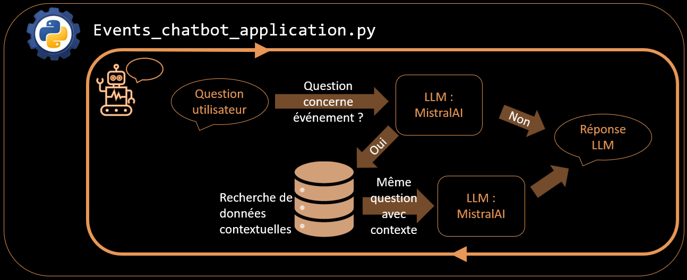

# Présentation

Ce projet POC consiste en une implémentation d'un chatbot de recommendation d'événnements utilisant l'API MistralAI ainsi qu'un système RAG(Retrival Augmented Generation)

Il est constitué de:
- Script de récupération d'événnements récents depuis Open Agenda et enregistrement des événnements en local sous format csv
- Script de construction d'un index FAISS à partir du fichier csv d'événnements précédemment importé
- Script de chatbot utilisant l'index FAISS précédemment généré
- tests unitaires


# Objectifs

Développer un POC RAG fonctionnel sous forme de chatbot capable de fournir des recommendations d'événnements 
- Mettre en place un environnement virtuel et fixer les versions de librairies utilisées afin ed rendre le fonctionnement reproductible.
- Récupérer des données d'événnements via l'API OpenAgenda, les filtrer sur un secteur géographique précis (ex: Paris) et se limiter sur des données récentes (1 an).
- Nettoyage des données et découpage des textes en vue de la vectorisation et indexation dans base de données FAISS.
- Chatbot exploitant l'API MistralAI pour converser ainsi qu'utilisant les événnements indexés dans FAISS pour donner des réponses contextuelles.


# Description des fichiers/dossiers

```
project/
├── src/                                # Répertoire sources
│ └── events_rag_project/               # Répertoire des sources du projet RAG
│   ├── config/                         # Répertoire de configuration
│   │   ├── __init__.py                 # Définition du package python
│   │   ├── paths.py                    # Chemins fichiers
│   │   ├── prompts.py                  # Prompts LLM
│   │   └── model_options.py            # Configuration modèle
│   │
│   ├── __init__.py                     # Définition du package python
│   ├── agenda_importer.py              # Importation des événnements OpenAgenda
│   ├── event_rag_service.py            # Logique RAG principale 
│   ├── event_vector_builder.py         # Création embeddings + index FAISS
│   └── events_chatbot_application.py   # Application chatbot
│
├── data/                               # Répertoire de données
│   └── events.csv                      # Données openAgenda importées
│
├── vector_store/                       # Répertoire de base de données vectorielle
│   ├── faiss_index/                    # Répertoire de l'index FAISS
│   │   ├── index.faiss                 # Fichier contenant les index vectoriels
│   │   └── index.pkl                   # Métadonnées associées à l'index FAISS
│   │
│   └── store.pkl                       # Fichier pickle contenant les associations ids/textes et ids/metadonnées
│
├── tests/                              # Répertoire des tests
│   ├── test_dev_stack.py               # Tests de fonctionnement des principales librairies utilisées
│   │── test_faiss_search.py            # Tests sur fichier index.faiss
│   │── test_imported_events.py         # Tests sur fichier events.csv
│   └── test_store.py                   # Tests sur fichier store.pkl
│
|── logs/                               # Répertoire de logs
│   │── answer_quality.csv              # Answer quality test logs
│   └── interaction_logs.jsonl          # Chat interactions logs
│
├── .env                                # Fichier de configuration des variables d'environnement
├── pyproject.toml                      # Configuration du projet
├── environment.yml                     # Fichier décrivant l'environnement Conda
├── pytest.ini                          # Fichier de configuration des tests
└── README.md                           # Documentation du projet
```

# Instructions

## Creation de l'environnement conda

```
conda env create -f environment.yml
conda activate pulsev_rag_env
```

## Variables d'environnements
Vous aurez besoin d'un token HuggingFace, générable depuis ce site: https://huggingface.co/docs/hub/security-tokens
Vous aurez besoin d'un token Mistral AI, générable depuis ce site: https://docs.mistral.ai/getting-started/quickstarts/studio/activate-and-generate-api-key

Editer le fichier .env à la racine du projet

```
HF_TOKEN=your_huggingface_token_key
MISTRAL_API_KEY=your_mistral_token_key
```

# Fonctionnement

- Récupération des données d’événements OpenAgenda (filtré sur événnements dans la ville de Paris et se terminant après aujourd'hui - 365 jours et avant aujourd'hui + 365 jours)
- Normalization des textes, nettoyage, suppression des doublons, sélection des champs utiles, suppression des doublons, traitement des valeurs Nan ou vide 
- Transformation en texte + métadonnées -> vector_store/store.pkl
- Génération d’embeddings
- Indexation dans FAISS -> vector_store/faiss_index/index.faiss
- Recherche sémantique
- Génération de réponse via LLM MistralAI


# Importation / Nettoyage / Mise à jour des événnements OpenAgenda

Réécriture du fichier .\data\events.csv avec les événnements récents

```
python .\src\events_rag_project\agenda_importer.py
```


# Regénération de l'index FAISS

A noter que la reconstruction de l'index prend plusieurs minutes.

Réécriture des fichiers:
    - .\vector_store\store.pkl
    - .\vector_store\faiss_index\index.faiss
    - .\vector_store\faiss_index\index.pkl

```
python .\src\events_rag_project\event_vector_builder.py
```


# Lancement du chatbot

```
python .\src\events_rag_project\event_chatbot_application.py
```

## Schema




# Tests
- test_dev_stacks.py: permet de valider la compatibilité des versions des différentes librairies utilisées dans le projet
- test_imported_events.py: Valide la cohérence des données importées depuis OpenAgenda
- test_faiss_search.py: Validation du contenu et cohérence du fichier index.faiss
- test_store.py: permet de valider le contenu du fichier pickle store.pkl contenant les associations ids/textes et ids/metadonnées
- test_quality_of_chat_answers.py: Evaluation des réponses données par le chat en fonction de réponses attendues

Pour lancer les tests depuis le répertoire racine. Il peut être nécessaire d'installer les packages du projet avant de pouvoir exécuter les tests

```
pip install -e .
```

Exécuter les tests:

```
pytest
```
